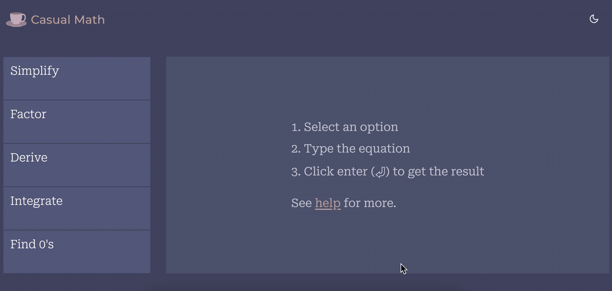

# Casual Math

A React application to solve simple math operations. Currently, there are five options available:
- Simplify
- Factor
- Derive
- Integrate
- Find 0's

[Newton API](https://github.com/aunyks/newton-api) —_a really micro micro-service for advanced math_— is used to get the result. 

The result is displayed with KaTeX, using [`react-katex`](https://github.com/talyssonoc/react-katex).

Validity of an expression (whether it is well-formed) is checked with the help of [`math-expression-evaluator`](https://github.com/bugwheels94/math-expression-evaluator). Since the expressions can be complex equations, it is hard to do a 100% coverage, but it is sufficient for evaluating simple strings. That said, something like abcd+efg is well-formed, but 123++- is not. In that case, an error message informing the user is displayed. 

### An example usage:

